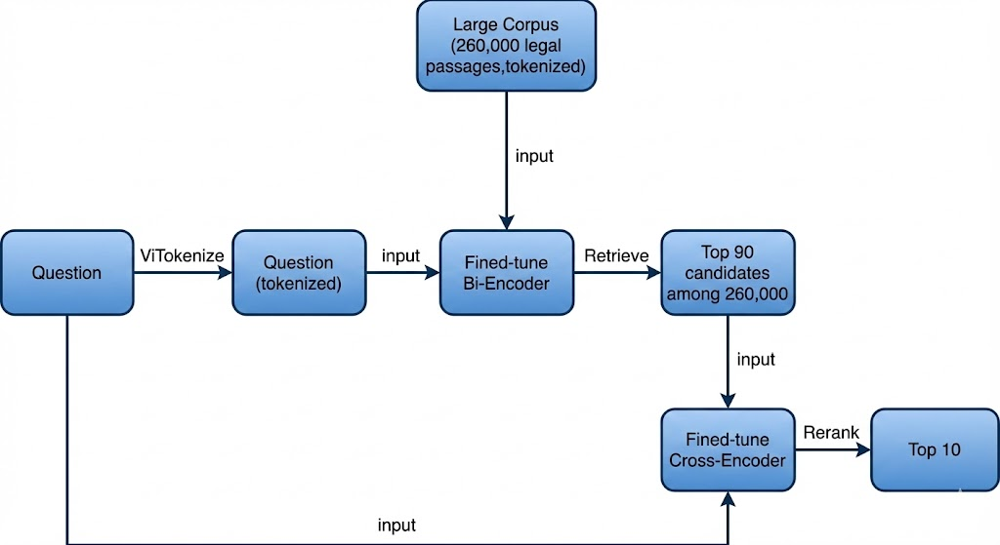

# Legal Document Retrieval - SoICT Hackathon 2024

Đây là solution đạt **Top 3** tại cuộc thi [Legal Document Retrieval - SoICT Hackathon 2024](https://aihub.ml/competitions/715#results), với **MRR@10 = 0.7754** trên tập **private test**. Link [paper](https://arxiv.org/pdf/2507.14619)

## 🧾 Nhiệm vụ

Truy vấn và tìm kiếm thông tin pháp luật từ các văn bản tiếng Việt.

## 📦 Dữ liệu

Dữ liệu được cung cấp bởi ban tổ chức bao gồm 3 tập:

- **Training data**: 119,456 cặp (truy vấn, văn bản liên quan) — dùng để huấn luyện mô hình.
- **Public test**: 10,000 truy vấn — dùng để đánh giá công khai.
- **Private test**: 50,000 truy vấn — dùng để đánh giá cuối cùng trên hệ thống.
- **Legal passages**: 260,000 passages

> **Tiêu chí đánh giá**: MRR@10

## ⚙️ Phương pháp

Pipeline của chúng tôi gồm 2 giai đoạn:

1. **Retrieval** — sử dụng Bi-Encoder: [`vietnamese-bi-encoder`](https://huggingface.co/models)
2. **Re-ranking** — sử dụng Cross-Encoder: [`itdainb/PhoRanker`](https://huggingface.co/itdainb/PhoRanker)

### Training 


### Inference




### Chi tiết:

- Vì dữ liệu chỉ có dạng Question-Answer, việc fine-tune dễ gây **bias**.
- Với **Bi-Encoder**, chúng tôi sử dụng **MultiNegativeRanking loss**.
- Với **Cross-Encoder**, chúng tôi áp dụng **negative mining** để tăng chất lượng mô hình.

### Lưu ý:

- Tập training được chia nhỏ thành `train` và `eval` để tự đánh giá do hạn chế số lần nộp bài.
- Sự khác biệt giữa các tập `eval`, `public`, `private` là **không đáng kể**.
- Phương pháp **không dùng ensemble** nhưng vẫn đạt hiệu quả cao.
- Dễ dàng **mở rộng** cho các dataset khác chỉ có dạng QA.

Do kích thước mô hình và cơ sở dữ liệu khá lớn, bạn cần tải thủ công các tệp từ liên kết sau:  
🔗 [Tải xuống tại đây](https://drive.google.com/drive/folders/1pWYtYJBIAoI6O_LrThFVANYQQs8a7W7O?usp=sharing)

Sau khi tải về, vui lòng thay thế các thư mục gốc của dự án bằng các thư mục tương ứng:  
- `data`  
- `result`  
- `saved_model`

## 📁 Cấu trúc code

```
Legal-Document-Retrieval/
│
├── 📄 Scripts chính
│   ├── data_processing.py          # Xử lý dữ liệu thô thành định dạng phù hợp
│   ├── train_bi.py                 # Huấn luyện Bi-Encoder
│   ├── train_cross.py              # Huấn luyện Cross-Encoder
│   ├── predict_bi.py               # Dự đoán với Bi-Encoder (retrieval)
│   ├── predict_cross.py           # Dự đoán với Cross-Encoder (re-ranking)
│   ├── negative_mining.py          # Tạo negative examples cho Cross-Encoder
│   ├── evaluation.py               # Đánh giá mô hình (MRR@10, Exist@10)
│   ├── bm25.py                     # Thử nghiệm BM25 (optional)
│   └── run.py                      # Script chạy inference với câu hỏi tùy chỉnh
│
├── 📂 src/                          # Thư viện tiện ích
│   ├── utils.py                    # Các hàm tiện ích: get_candidate, mrr_m, exist_m
│   └── get_negative.py             # Hàm tạo negative examples: ran_negative, hard_negative
│
├── 📂 data/                         # Dữ liệu
│   ├── raw/                        # Dữ liệu thô từ ban tổ chức
│   │   ├── train.csv
│   │   └── corpus.csv
│   ├── processed/                  # Dữ liệu đã xử lý
│   │   ├── train.csv
│   │   ├── eval.csv
│   │   ├── corpus.csv
│   │   └── 3_moderateneg_ex.csv    # Negative examples cho Cross-Encoder
│   └── database/                   # Embeddings database
│       └── database.npy            # Embeddings của corpus (để tăng tốc retrieval)
│
├── 📂 saved_model/                  # Mô hình đã huấn luyện
│   ├── BiEncoder/
│   │   └── model1/
│   │       └── best/               # Best checkpoint của Bi-Encoder
│   └── CrossEncoder/
│       └── model1/                 # Best checkpoint của Cross-Encoder
│
├── 📂 result/                       # Kết quả dự đoán và đánh giá
│   ├── BiEncoder/
│   │   └── model1/
│   │       ├── outputtrain.txt     # Predictions trên train set
│   │       ├── outputeval.txt      # Predictions trên eval set
│   │       └── score.json          # Điểm số đánh giá
│   └── CrossEncoder/
│       └── model1/
│           ├── output.txt          # Final predictions sau re-ranking
│           └── score.json         # Điểm số đánh giá
│
├── 📂 images/                       # Hình ảnh minh họa workflow
│   ├── training.jpg
│   └── inference.jpg
|
├── requirements.txt                 # Dependencies
└── README.md                        # Tài liệu hướng dẫn
```

### Mô tả các file chính:

- **`data_processing.py`**: Xử lý dữ liệu thô, tách train/eval, chuẩn hóa văn bản
- **`train_bi.py`**: Fine-tune Bi-Encoder với MultiNegativeRanking loss
- **`predict_bi.py`**: Sử dụng Bi-Encoder để retrieval top-k candidates
- **`negative_mining.py`**: Tạo hard/random negative examples từ predictions của Bi-Encoder
- **`train_cross.py`**: Fine-tune Cross-Encoder với negative examples
- **`predict_cross.py`**: Re-rank candidates từ Bi-Encoder bằng Cross-Encoder
- **`run.py`**: Script inference end-to-end cho câu hỏi tùy chỉnh
- **`src/utils.py`**: Các hàm tiện ích cho retrieval và evaluation
- **`src/get_negative.py`**: Các chiến lược tạo negative examples

## 🚀 Reproduce

### 1. Data processing:

```bash
$python data_processing.py 
``` 

### 2. Train BiEncoder: 
```bash
$python train_bi.py
#$python bm25.py (Optinal) Thử nghiệm BM25:
``` 
### 3. Retrieval candiates: 

```bash
$python predict_bi.py --train
```
### 4. Get negative examples for CrossEncoder training: 

```bash
$python negative_mining.py 
``` 

### 5. Train CrossEncoder

```bash
$python train_cross.py
``` 

### 6. Re-rank candidates by CrossEncoder: 

```bash
$python predict_cross.py 
``` 
## 🚀 Hướng dẫn sử dụng

Bạn có thể đặt câu hỏi liên quan đến pháp luật Việt Nam bằng cách sử dụng dòng lệnh như sau:

```bash
$ python run.py --question "Tội bán hàng giả bị xử lý như thế nào?"
``` 
## 📬 Liên hệ

Nếu bạn có bất kỳ thắc mắc hoặc góp ý nào, vui lòng liên hệ qua email:  
📧 [22520465@gm.uit.edu.vn](mailto:22520465@gm.uit.edu.vn)
